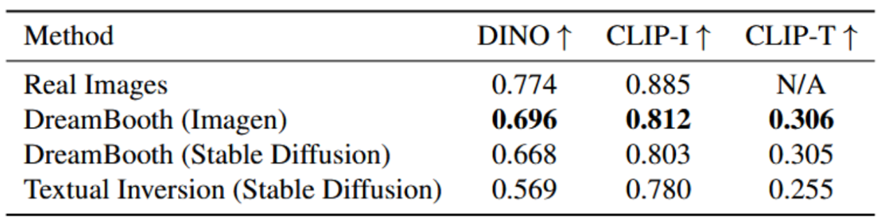

# DreamBooth Reproduction


## Introduction

This repository reproduces
[DreamBooth: Fine Tuning Text-to-Image Diffusion Models for Subject-Driven Generation](https://arxiv.org/abs/2208.12242).
This repository fine-tunes Stable Diffusion on a small set of subject images,
generates subject-driven images from the adapted model, and evaluates the
outputs with DINO, CLIP-I, and CLIP-T similarity metrics.

DreamBooth adapts a text-to-image diffusion model to a specific subject using a
small number of reference images and a unique identifier token. This
implementation trains Stable Diffusion with the DreamBooth objective:

```text
loss = reconstruction_loss + prior_loss_weight * prior_preservation_loss
```

The reconstruction loss teaches the model the target subject, while the prior
preservation loss helps retain the general class concept, such as `cat`,
`dog`, or `toy`.

## Chosen Result

We intend to reproduce the fine-tuning pipeline in the paper, fine-tune a few models to generate some visual results, and implement the metrics in the table below. Since Imagen is a closed-source model, we only fine-tune on stable diffusion models.



## GitHub Contents

```text
code/
  train_dreambooth.py       DreamBooth training entry point
  inference_dreambooth.py   Image generation from trained checkpoints
  eval.py                   DINO, CLIP-I, and CLIP-T evaluation
data/
  dreambooth_original/      Official DreamBooth subject images
  generated/                Generated class images for prior preservation
  our_data/                 Custom subject images collected for this project
poster/                     Project poster
report/                     Project report
results/                    Generated examples, comparisons, and metrics
```

## Re-implementation Details

We re-implement DreamBooth by fine-tuning Stable Diffusion v1.5 with the
original DreamBooth subject images and our own collected subjects. Training uses
the Hugging Face Diffusers and Accelerate tooling with prior preservation class
images generated for each subject. Since Imagen is not publicly available, we
use Stable Diffusion as the base text-to-image model while keeping the
DreamBooth objective and prompt format. Evaluation follows the paper's subject fidelity and prompt alignment goals using DINO, CLIP-I, and CLIP-T similarity metrics.

## Reproduction Steps

### Setup

A GPU like T4 or better is recommended for the project.

Install the required Python packages:

```bash
pip install -r requirements.txt
```

Training and inference use Stable Diffusion v1.5 by default:

```text
runwayml/stable-diffusion-v1-5
```

GPU acceleration is strongly recommended for training.

### Training

The training entry point is `code/train_dreambooth.py`. A typical run with prior
preservation is:

```bash
accelerate launch code/train_dreambooth.py \
  --pretrained_model_name_or_path runwayml/stable-diffusion-v1-5 \
  --instance_data_dir data/dreambooth_original/cat2 \
  --class_data_dir data/generated/cat-stable-diffusion-1_5 \
  --instance_prompt "a sks cat" \
  --class_prompt "a cat" \
  --with_prior_preservation \
  --num_class_images 100 \
  --max_train_steps 800 \
  --output_dir outputs/cat
```

`--instance_data_dir` points to the few-shot subject images, such as
`data/dreambooth_original/cat2` or `data/our_data/bottle`. These images are
paired with the instance prompt, such as `"a sks cat"`, and contribute the
reconstruction loss.

`--class_data_dir` points to generic class images used for prior preservation.
If the directory has fewer than `--num_class_images` images, the training script
can generate the missing images from the base model using `--class_prompt`.

The trained weights are saved to `--output_dir`.

## Inference

Use `code/inference_dreambooth.py` to generate images from a trained checkpoint:

```bash
python code/inference_dreambooth.py \
  --checkpoint_dir outputs/cat \
  --prompt "a sks cat in a garden" \
  --output_dir outputs/inference/cat_garden \
  --num_images 4 \
  --seed 0
```

The script supports LoRA checkpoints, full Stable Diffusion pipelines, and UNet
checkpoints through `--checkpoint_type`.

### Evaluation

The evaluation entry point is `code/eval.py`. It compares generated images with
reference images and prompts using:

- **DINO**: image-to-image similarity using self-supervised visual features.
- **CLIP-I**: image-to-image similarity in CLIP embedding space.
- **CLIP-T**: image-to-text similarity in CLIP embedding space.

Run evaluation with the default example directories:

```bash
python code/eval.py
```

Use the simplified dataset option to evaluate a named dataset from the repository structure:

```bash
python code/eval.py --dataset cat2
```

This sets:

- reference images: `data/dreambooth_original/<dataset>`
- generated images: `results/<dataset>`

Short options are also supported:

- `-r` / `--reference_dir`
- `-g` / `--generated_dir`
- `-d` / `--dataset`

Or provide custom paths:

```bash
python code/eval.py \
  -r path/to/reference/images \
  -g path/to/generated/images \
  --prompts_file path/to/prompts.txt \
  --output_dir path/to/output
```

When `--output_dir` is omitted, the script saves metric files by default to `results/metrics/<generated_dir_name>`.

Evaluation logs are written as timestamped JSON files, for example
`eval_log_20260428_143022.json`.

## Results

The `results/` directory contains generated image grids, prior-preservation
comparisons, and a metric comparison between reported DreamBooth baselines and
this reproduction.

### Expression Modification


### Viewpoint Modification


### Background Modification


### Outfit Modification


### With and Without Prior Preservation


### Quantitative Metrics


## Conclusion

This re-implementation shows that DreamBooth can be reproduced with open-source
Stable Diffusion checkpoints while preserving the core training objective and
subject-driven generation behavior. The main lessons were that diffusion models can learn to generate a specific subject by finetuning on a few images, and prior preservation is important for reducing overfitting. The largest practical challenge was hyperparameter tuning since the original paper does not specify the training details.

## Acknowledgements

This project was completed as part of coursework for CS5782 at Cornell
University. We acknowledge the original DreamBooth authors for their method,
paper, and released subject datasets, as well as the open-source Stable
Diffusion, Diffusers, Accelerate, CLIP, and DINO communities whose tools made
this reproduction possible.

## References

Ruiz et al., "DreamBooth: Fine Tuning Text-to-Image Diffusion Models for
Subject-Driven Generation." [arXiv:2208.12242](https://arxiv.org/abs/2208.12242)
